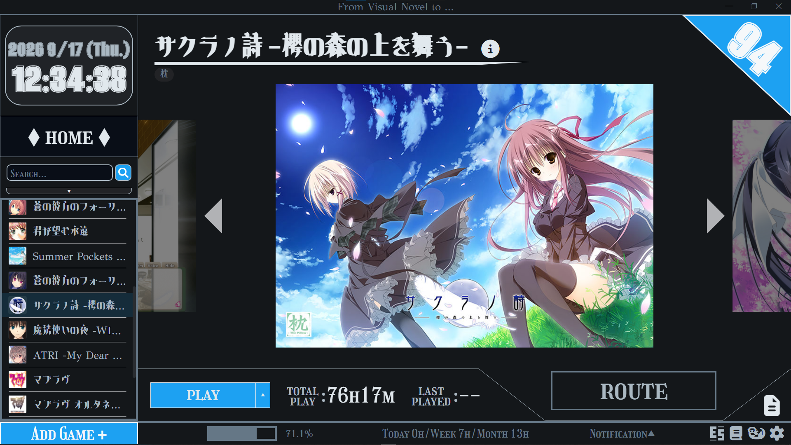
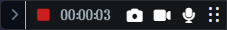
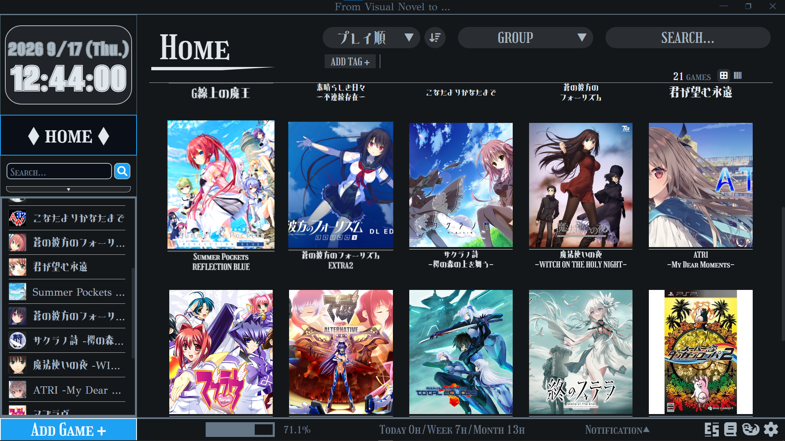
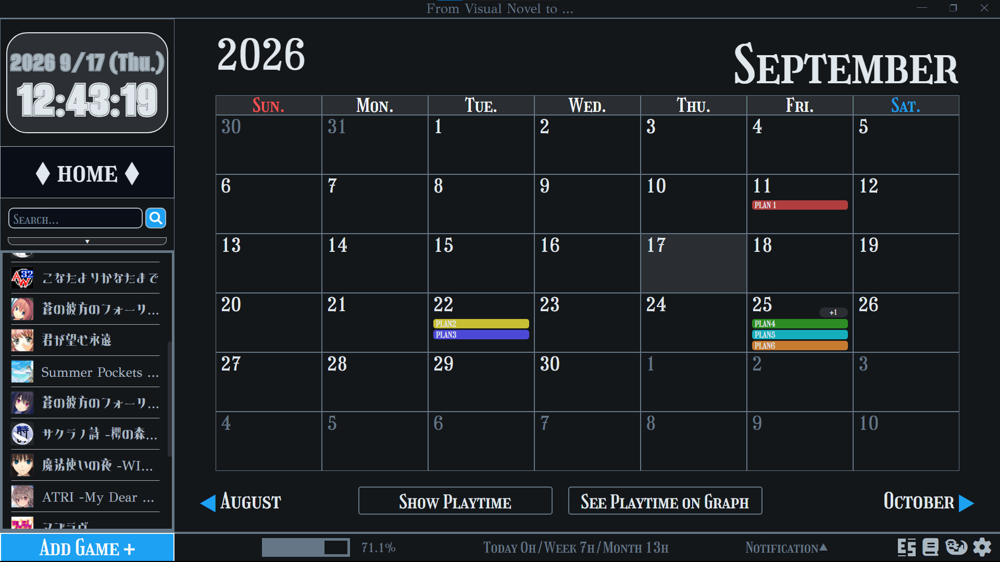
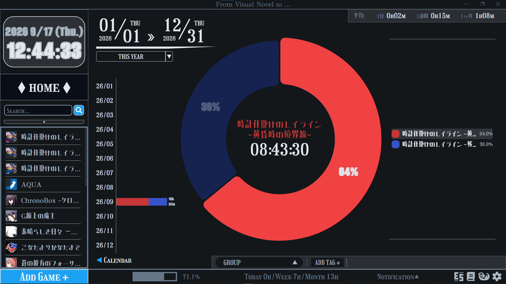

# From Visual Novel to

主にノベルゲーム（ビジュアルノベル）のライブラリを管理するための Windows デスクトップアプリです。
ゲームを登録してアプリから起動でき、プレイ時間を自動で記録します。プレイ中は小さな「レコーダーパネル」を最前面に表示し、経過時間の確認・一時停止・スクリーンショット・録画・録音ができます。



プレイ中は、下のような小さな「レコーダーパネル」が最前面に表示されます。



## 主な機能

- **ゲームの登録・起動** … 実行ファイルを登録し、アプリから起動。グループやタグで整理、並び替え・検索も可能
- **プレイ時間の自動計測** … 起動から終了までを自動で記録（一時停止した時間は除外）
- **レコーダーパネル** … プレイ中に最前面表示。経過時間・一時停止・スクリーンショット・画面録画・音声録音
- **ライブラリ表示（Home）** … サムネイル一覧／本棚表示、ゲームごとの画像ギャラリー
- **カレンダー / プレイタイムグラフ** … 日ごと・期間ごとのプレイ時間を可視化、予定（プラン）の管理
- **帳簿** … ゲームの購入・売却を記録して集計
- **ボイス管理** … キャラクターごとの音声ファイルを登録・再生
- **CSV 書き出し** … ライブラリの情報を CSV でエクスポート
- **自動バックアップ** … 起動時にライブラリをバックアップ（日/週/月/年の世代管理）
- **日本語 / 英語 切り替え**、日本語フォントの変更 など

## スクリーンショット

### ホーム（ライブラリ一覧）



### カレンダー



### プレイタイムグラフ



## ダウンロード / インストール

1. [Releases](../../releases) ページを開く
2. 最新版の **`From-Visual-Novel-to-<バージョン>-setup.exe`** をダウンロード
3. ダウンロードした exe を実行してインストール

> **⚠️ SmartScreen の警告について**
> このアプリはコード署名をしていないため、初回実行時に「WindowsによってPCが保護されました」という警告が出ることがあります。
> その場合は **「詳細情報」→「実行」** の順にクリックすると起動できます。

### 動作確認済

- Windows 10（64bit）

## 自動アップデート

新しいバージョンが公開されると、アプリが自動で検知してバックグラウンドでダウンロードし、次にアプリを終了したときに更新されます。手動での入れ直しは不要です。

## アンインストール

「設定 → アプリ → インストールされているアプリ」から **「From Visual Novel to」** を選んでアンインストールしてください。
アンインストール時に、**ライブラリのデータ（登録内容・画像・設定）を残すか削除するか**を選べます。残しておけば、再インストール時にそのまま引き継げます。

## お問い合わせ・使い方

- 使い方・コンタクト: [note](https://note.com/from_vn_to)

---

## 開発者向け

Electron + TypeScript + React + better-sqlite3 で作られています。

```bash
npm install       # 依存関係のインストール
npm run dev       # 開発用に起動（HMR）
npm run build     # 型チェック＋ビルド
npm run dist      # Windows インストーラを作成（release/ に出力）
```

`npm run dist` がシンボリックリンク作成エラー（winCodeSign）で失敗する場合は、次のいずれかを行ってください。

- Windows の「開発者モード」を有効化する（設定 → プライバシーとセキュリティ → 開発者向け）、または
- 管理者権限のターミナルで実行する

## ライセンス

[MIT](LICENSE)

---
---

# From Visual Novel to (English)

> **Note:** This English section was translated from the Japanese above by Claude (an AI assistant). It may contain translation errors — the Japanese version above is authoritative.

A Windows desktop app mainly for managing a library of visual novels. You can register games and launch them from the app, and your play time is tracked automatically. While you play, a small "Recorder Panel" stays on top of other windows so you can check the elapsed time, pause, take screenshots, and record video or audio.


While you play, a small "Recorder Panel" like the one below stays on top of your screen.


## Features

- **Register and launch games** — register an executable and start it from the app; organize with groups and tags, reorder, and search
- **Automatic play-time tracking** — records from launch to exit (paused time is excluded)
- **Recorder Panel** — an always-on-top panel while you play: elapsed time, pause, screenshot, screen recording, and audio recording
- **Library views (Home)** — thumbnail grid / bookshelf view, and a per-game image gallery
- **Calendar / Playtime graph** — visualize play time by day and by period, and manage plans
- **Ledger** — record and total your game purchases and sales
- **Voice manager** — register and play back voice files per character
- **CSV export** — export your library information as CSV
- **Automatic backup** — backs up your library on launch (day / week / month / year generations)
- **Japanese / English switch**, changeable Japanese font, and more

## Screenshots

### Home (library)


### Calendar


### Playtime graph


## Download / Install

1. Open the [Releases](../../releases) page
2. Download the latest **`From-Visual-Novel-to-<version>-setup.exe`**
3. Run the downloaded exe to install

> **⚠️ About the SmartScreen warning**
> This app is not code-signed, so on first run Windows may show a "Windows protected your PC" warning.
> If so, click **"More info" → "Run anyway"** to start it.

### Tested on

- Windows 10 (64-bit)

## Automatic updates

When a new version is published, the app detects it, downloads it in the background, and updates itself the next time you quit. No manual reinstall is needed.

## Uninstall

Uninstall **"From Visual Novel to"** from *Settings → Apps → Installed apps*.
During uninstall you can choose **whether to keep or delete your library data (your registered entries, images, and settings)**. If you keep it, a reinstall picks it up as it was.

## Contact / How to use

- [Ko-fi](https://ko-fi.com/fromvisualnovelto)

---

## For developers

Built with Electron + TypeScript + React + better-sqlite3.

```bash
npm install       # install dependencies
npm run dev       # run in development (HMR)
npm run build     # type-check + build
npm run dist      # build the Windows installer (output in release/)
```

If `npm run dist` fails with a symbolic-link error (winCodeSign), do one of the following:

- Enable Windows "Developer Mode" (Settings → Privacy & security → For developers), or
- Run it in a terminal with administrator privileges

## License

[MIT](LICENSE)
